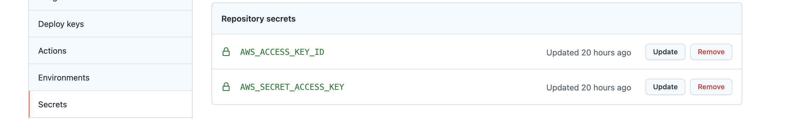

# `Container Application Security - CI/CD Pipeline using AWS for GitHub Actions`

[](https://github.com/jonahjon/container-app-security-cicd/actions/workflows/codeql.yml)

[](https://github.com/jonahjon/container-app-security-cicd/actions/workflows/deploytoaws.yml)

## Add the GH secrets for the github action

Using the [aws-credentials](https://github.com/aws-actions/configure-aws-credentials) Github action we will authenticate to our AWS account. To do this we have a few options.

Go to `Settings` > `Secrets` and add the keys for the GH actions ECR action.



## Initialize the ECR repo and Log group

Make sure you have `envsubst` installed.

```
make install
```

Or

```
make create-ecr 
make loggroup 
make env 
make task
``` 

one at a time. 

## Make a new commit to the Repo

If you want to change the badges, then replace `your GH username` with your GH username in the readme badges
